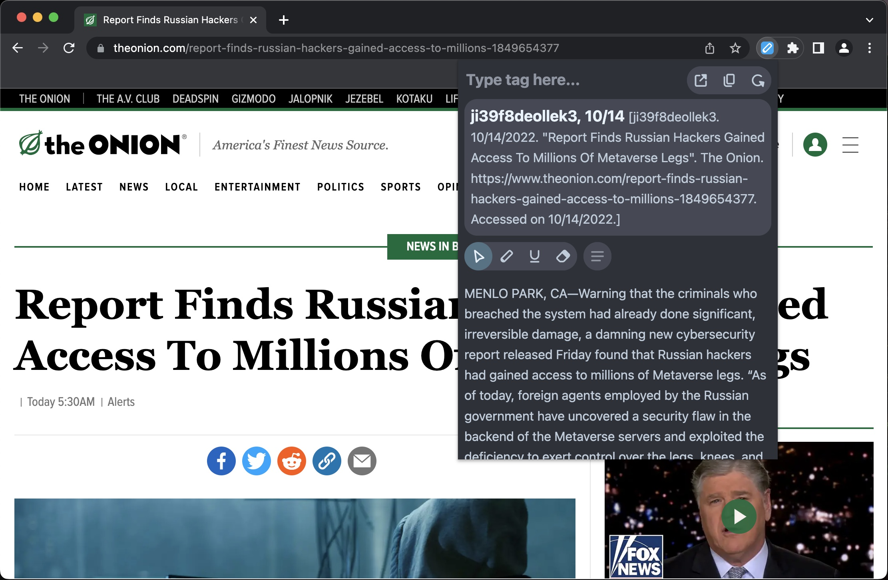

# Evidencer



A chrome extension that lets you scrape, highlight/underline, and export articles you see online as debate cards. Inspired by [Cardr](https://cardrdebate.com/).

Based on [this template](https://github.com/NekitCorp/chrome-extension-svelte-typescript-boilerplate) by [@NekitCorp](https://github.com/NekitCorp).

## Built with

- [Svelte](https://svelte.dev/) - UI framework
- [TypeScript](https://www.typescriptlang.org/) - Better than JavaScript
- [Vite](https://vitejs.dev/) - Bundler
- [Chrome Extensions Manifest V3](https://developer.chrome.com/docs/extensions/mv3/intro/) - Chrome extension standard
- [Readability](https://github.com/mozilla/readability) - Webpage scraper

## Usage

### Simple install

1. Go to [releases](https://github.com/Ashwagandhae/evidencer/releases/) and download `Evidencer.crx`.
2. Open the Extension Management page by navigating to `chrome://extensions`.
3. Drag `Evidencer.crx` on the page and click `Add Extension`.
4. Reload any websites that you want to use with the extension.

### Unpacked install

1. Go to [releases](https://github.com/Ashwagandhae/evidencer/releases/) and download `EvidencerUnpacked.zip`, and unzip the file.
2. Open the Extension Management page by navigating to `chrome://extensions`.
3. Enable developer mode by clicking the toggle switch next to `Developer mode`.
4. Click the `Load unpacked` button and select the unzipped `EvidencerUnpacked` folder.
5. Reload any websites that you want to use with the extension.

### Build from source

1. Clone the repository and build the extension.

```bash
# download repo
git clone https://github.com/Ashwagandhae/evidencer.git
cd evidencer
# install dependencies
npm i
# build files to `/dist` folder
npm run build
```

2. Open the Extension Management page by navigating to `chrome://extensions`.
3. Enable developer mode by clicking the toggle switch next to `Developer mode`.
4. Click the `Load unpacked` button and select the `dist` folder.
5. Reload any websites that you want to use with the extension.

## Develop

```bash
# download repo
git clone https://github.com/Ashwagandhae/evidencer.git
cd evidencer
# install dependencies
npm i
# build files to `/dist` directory
# vite.build.watch rebuilds when modules have changed on disk
npm run dev
```
